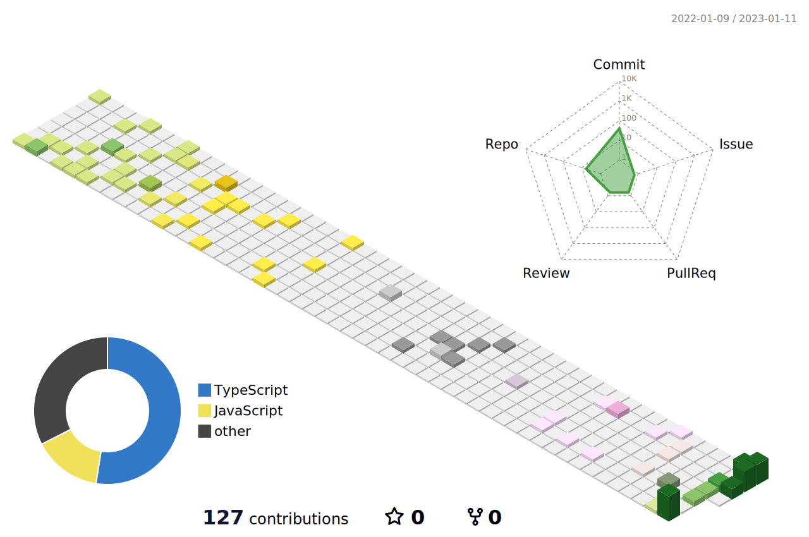

<h1> Hey! Nice to see you.</h1>

<p>I am a front-end engineer 🌱 , and also a full-stack developer, committed to become a good independent developer and open source contributor, recently interesting and practicing in lowcode, serverless, vite, SwiftUI, and Flutter。</p>

[](https://github.com/charchamp)
[](https://juejin.cn/user/272334611548173)
[](https://charchamp.cc/)
[](https://open.weixin.qq.com/qr/code?username=SenhaiTalks)

### 🛠 Platforms, languages and tools

**Web Developer**


<p>
  
  
  
  
  
  
  
  
</p>

**Backend Developer**

<p>
  
  
  
  
  
</p>

**Android Developer**

<p>


</p>

**DevOps**

<p>
  
  
  
  
</p>

**Environment**

<p>
  
  
</p>

### 📫 Contact me:

- Website: [charchamp.cc](https://charchamp.cc/)
- Email: [hi@charchamp.cc](mailto:hi@charchamp.cc)
- Twitter: [@charchampv](https://twitter.com/charchampv)

You can also ask me a question on my [Public AMA](https://github.com/charchamp/charchamp/discussions/new?category=ama)

My GPG key hosted here at [GitHub](https://github.com/charchamp.gpg) and also [Keybase](https://keybase.io/charchamp/pgp_keys.asc), see [Keybase proof](https://gist.github.com/charchamp/5e30b7d8d8659dae5c3bfc800375cdc7).



<details>
  <summary>:notebook: Some statistics ...</summary><br/>
  
<!--START_SECTION:waka-->


**🐱 My GitHub Data** 

> 🏆 41 Contributions in the Year 2023
 > 
> 📦 478.0 kB Used in GitHub's Storage 
 > 
> 🚫 Not Opted to Hire
 > 
> 📜 6 Public Repositories 
 > 
> 🔑 258 Private Repositories  
 > 
**I'm a Night 🦉** 

```text
🌞 Morning    10 commits     ██████░░░░░░░░░░░░░░░░░░░   26.32% 
🌆 Daytime    1 commits      ░░░░░░░░░░░░░░░░░░░░░░░░░   2.63% 
🌃 Evening    26 commits     █████████████████░░░░░░░░   68.42% 
🌙 Night      1 commits      ░░░░░░░░░░░░░░░░░░░░░░░░░   2.63%

```
📅 **I'm Most Productive on Saturday** 

```text
Monday       0 commits      ░░░░░░░░░░░░░░░░░░░░░░░░░   0.0% 
Tuesday      3 commits      ██░░░░░░░░░░░░░░░░░░░░░░░   7.89% 
Wednesday    2 commits      █░░░░░░░░░░░░░░░░░░░░░░░░   5.26% 
Thursday     4 commits      ██░░░░░░░░░░░░░░░░░░░░░░░   10.53% 
Friday       0 commits      ░░░░░░░░░░░░░░░░░░░░░░░░░   0.0% 
Saturday     16 commits     ██████████░░░░░░░░░░░░░░░   42.11% 
Sunday       13 commits     ████████░░░░░░░░░░░░░░░░░   34.21%

```


📊 **This Week I Spent My Time On** 

```text
⌚︎ Time Zone: Asia/Shanghai

💬 Programming Languages: 
Vue.js                   2 hrs 36 mins       █████████░░░░░░░░░░░░░░░░   38.43% 
TypeScript               1 hr 13 mins        ████░░░░░░░░░░░░░░░░░░░░░   17.97% 
JavaScript               49 mins             ███░░░░░░░░░░░░░░░░░░░░░░   12.04% 
JSON                     49 mins             ███░░░░░░░░░░░░░░░░░░░░░░   12.0% 
Other                    47 mins             ███░░░░░░░░░░░░░░░░░░░░░░   11.74%

🔥 Editors: 
VS Code                  6 hrs 48 mins       █████████████████████████   100.0%

💻 Operating System: 
Mac                      6 hrs 48 mins       █████████████████████████   100.0%

```

**I Mostly Code in Swift** 

```text
Swift                    23 repos            ███████░░░░░░░░░░░░░░░░░░   29.11% 
TypeScript               22 repos            ███████░░░░░░░░░░░░░░░░░░   27.85% 
Vue                      20 repos            ██████░░░░░░░░░░░░░░░░░░░   25.32% 
JavaScript               9 repos             ██░░░░░░░░░░░░░░░░░░░░░░░   11.39% 
Astro                    2 repos             ░░░░░░░░░░░░░░░░░░░░░░░░░   2.53%

```


 Last Updated on 09/01/2023 01:21:05 UTC
<!--END_SECTION:waka-->

<a href="https://github.com/charchamp#gh-light-mode-only"></a>
<a href="https://github.com/charchamp#gh-dark-mode-only"></a>
</details>
